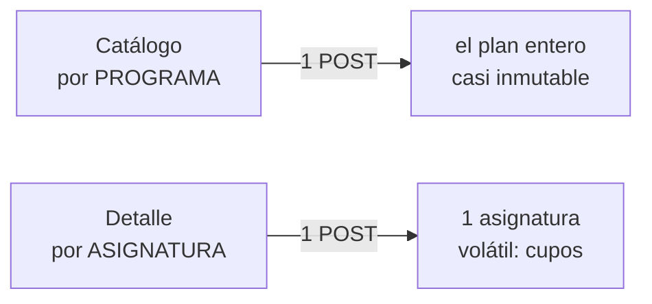

# CLAUDE.md

This file provides guidance to Claude Code (claude.ai/code) when working with code in this repository.

## Qué es esto

API puente en Go sobre el catálogo público de asignaturas del SIA (Universidad
Nacional de Colombia). El SIA solo expone el catálogo mediante una app Oracle ADF con
estado de sesión en servidor y navegación por POSTs de formulario encadenados. Este
proyecto traduce eso a JSON.

**Estado: en producción.** Tres piezas en este repo:

- **API** (`cmd/bridge` + `internal/`) — read-through de referencia, catálogo, detalle
  y cupos sobre Postgres. Contrato en `internal/httpapi/openapi.yaml`, servido en
  `/v1/docs`.
- **`Refresher`** (`cmd/refresher`) — barrido de la cache, **herramienta manual** sin
  cron. La API sirve el catálogo guardado y lo refresca por detrás
  (`Service.ServeStale`), así que nadie paga el miss que un barrido periódico evitaba.
- **Interfaz** (`web/`) — React + TypeScript. Habla la misma API pública que cualquier
  otro cliente: **nunca** toca Postgres ni importa nada de `internal/`.

**La sede es un segmento obligatorio de la ruta**: `/v1/campuses/{campus}/…`. No hay
sede ni nivel privilegiado en el código; las dos listas salen de sus dropdowns y se
cachean como cualquier otra referencia.

## Convención de idioma

- **Código en inglés**: identificadores, tipos, columnas SQL, endpoints, comentarios.
- **Documentación en español**, salvo `README.md`, que va en inglés (vitrina para quien llega sin contexto); `README.es.md` es su versión en español. Mantener los dos sincronizados.
- Los literales del SIA se conservan tal cual (`Cupos disponibles:`,
  `LIBRE ELECCIÓN (L)`, `MIÉRCOLES de 09:00 a 11:00.`) — son datos, no texto nuestro.

## Documentación: un número, un lugar

La documentación describe **cómo funciona hoy**, no la historia. **Las cifras viven solo
en `docs/CONSTANTS.md`** (medidas del SIA y constantes del código) y en `.env.example`
(defaults de entorno). Todo lo demás nombra la constante: "como mucho
`maxTotalConnections` sesiones", nunca "como mucho 80". La evidencia de cada medida está
en `docs/GOTCHAS.md`.

`internal/config/constants_doc_test.go` falla si `CONSTANTS.md` y el código no
coinciden. Una constante nueva que se mencione en la documentación entra a esa tabla.

**Diagramas: Mermaid casi siempre.** Flujos, arquitectura, secuencias, estados y esquemas
van en bloques ` ```mermaid `, nunca como dibujo ASCII ni como imagen. La excepción es
**listar archivos o carpetas**: eso va como árbol de texto en un bloque de código (estilo
`tree`, con un comentario corto por línea), porque se lee de arriba abajo igual que en el
editor. Antes de hacer commit de un diagrama, renderízalo y míralo: si las flechas se
cruzan o el orden sale invertido, reordénalo.

## Antes de hacer commit

Lee **`docs/COMMIT-CONVENTION.md`**. `semantic-release` lee el mensaje del commit de
merge a `main` para versionar (`vX.Y.Z`) — un prefijo (`feat:`, `fix:`, …) fuera de
formato no rompe nada, pero deja el deploy sin Release ni changelog.

## Antes de escribir código

Lee **`docs/GOTCHAS.md`** completo. No es opcional. Son trampas verificadas contra el
servidor real, varias de las cuales fallan **en silencio** (devuelven datos plausibles
pero equivocados). El proyecto anterior murió por asumir mal cuatro de ellas. El
documento crece: cuántas hay y cuál es la última se leen ahí, no acá.

Las cuatro que más código han roto:

1. **La región de detalle está numerada y el número sube.** Volver es
   `pt1:r1:<N>:cb4`, con `N` leído de la respuesta del detalle. Con `1` fijo, la
   segunda asignatura de la sesión la deja inservible y **parece sesión caducada**.
2. **El User-Agent no puede parecer navegador.** Con un UA de Chrome el servidor
   devuelve un bootstrap JS en vez de la página. El default de Go funciona; no lo
   "mejores".
3. **`_afrRK` se acumula entre búsquedas y se renumera en cada re-render.** Nunca
   enumeres posicionalmente, nunca caches la lista de row keys. Re-parsea siempre.
   Tampoco empieza en 0: el bootstrap puede llegar con la tabla de otra sesión.
4. **Una respuesta diminuta con status 200 no es éxito, es un no-op.** Significa que
   falta un paso de la cascada, que estás en la región de detalle, o que caducó la
   sesión. Trátala como error explícito.

## Mapa del repo

| Ruta | Qué hay |
|---|---|
| `docs/ARCH.md` | **Arquitectura**: hexágono, read-through, pool de sesiones, `Refresher`, lo que no sabemos |
| `docs/DIAGRAMS.md` | Diagramas Mermaid de todo el proyecto: hexágono, flujos de cada petición, pool, esquema |
| `docs/CONSTANTS.md` | **El único documento con cifras**: medidas del SIA y constantes del código |
| `docs/GOTCHAS.md` | **Las trampas verificadas contra el servidor. No se edita sin evidencia nueva** |
| `docs/PROTOCOL.md` | Handshake ADF, POST por POST |
| `docs/FIELDS.md` | Componentes ADF, opciones de cada dropdown, mapeo a columnas |
| `docs/API.md` | Contrato HTTP: identificadores, frescura, errores |
| `docs/DATA-MODEL.md` | Las decisiones del esquema que no son obvias leyendo el DDL |
| `docs/DEVELOPMENT.md` | Entorno: Docker, Postgres, fixtures, cómo replicar el flujo |
| `docs/COMMANDS.md` | Chuleta: deploy, migraciones, qué versión corre dónde, cómo borrar todo |
| `docs/COMMIT-CONVENTION.md` | **Formato de commits — leer antes de hacer commit** |
| `web/README.md` | La interfaz: cómo correrla y cómo está armada |
| `internal/httpapi/openapi.yaml` | **El contrato que manda.** `docs/API.md` explica el porqué, no la forma |
| `migrations/` | **El esquema que corre.** `docs/DATA-MODEL.md` no lo transcribe |
| `.env.example` | **La fuente de verdad de puertos y variables.** Ningún doc los repite |
| `bruno/sia-catalogo/` | Colección Bruno: el flujo ADF crudo, a mano contra el SIA |
| `bruno/bridge-api/` | Colección Bruno: esta API, endpoint por endpoint |

## Arquitectura acordada

Hexagonal. Dos adaptadores driving (`httpapi` y `refresher`) y dos driven (`store`
Postgres, `sia` ADF). Detalle en `docs/ARCH.md`.

El `Refresher` **no escribe en la base**: entra por los mismos casos de uso que `httpapi`
(`catalog.Service`), así que hay un solo upsert de catálogo. Levanta **su propio pool**, y
la invariante que no se negocia es
`SIA_POOL_SIZE + REFRESH_POOL_SIZE ≤ maxTotalConnections`. Su checkpoint son los
marcadores de frescura, no un cursor: reanudar es volver a correr.

Flujo principal: **read-through**. Catálogo y referencia, que casi no cambian, son
*stale-while-revalidate*: lo guardado se responde al instante y el SIA se consulta por
detrás. El detalle y los cupos no: ahí se espera.

Dos caches con granularidad distinta — esto es lo que más se malentiende:



Ese POST de catálogo trae **todas menos las de libre elección** (`soc4=0` significa eso
literalmente). Las libres del plan salen del buscador de electivas, que es por sede. El
catálogo de un plan son dos consultas.

## `SIASource` no es un cliente HTTP

Es un **pool de sesiones ADF con estado**. Cada conexión:

- muere tras unos minutos de inactividad; el keepalive del pool la mantiene viva
- es **estrictamente secuencial**: una operación lógica en vuelo a la vez (§28)
- está parqueada en un `(level, campus, faculty, program)`; moverla cuesta POSTs
- está en la región del buscador **o** en una región de detalle **numerada**

N peticiones concurrentes ⇒ N conexiones, con el mutex **sobre la operación lógica**
(cascada + `cb1`, detalle + Volver), no sobre el POST. Lo que pasa de
`foregroundPerIP` por IP, o pide `?background=1`, va al carril de fondo: la mitad del
pool como máximo.

## Modelado: cinco cosas que no son obvias

- El listado devuelve **ofertas, no asignaturas**: los códigos se repiten. Clave natural
  de un grupo `(code, term, key)` — `key` es el token entre paréntesis, porque
  `Grupo N` se repite entre regulares y PEAMA.
- **Los grupos visibles dependen del programa**; **los cupos son globales**. Por eso
  `section` es global y `section_program` es la visibilidad.
- **La tipología depende del programa.** Vive en `course_program`.
- **`program.code` no identifica.** Se repite entre sedes (PEAMA). La identidad es
  `(campus_code, faculty_code, code)`.
- `group` es **palabra reservada en SQL**. Se usa `section`.

## Interfaz (`web/`)

Para diseñar, revisar o arreglar UI usa la skill **`ui-ux-pro-max`**
(accesibilidad, tipografía, color, layout responsive) y, para tokens,
**`design-system`**: las dos están fijadas en `skills-lock.json` y se instalan con
`npx skills experimental_install`. Ojo con lo que asumen: la interfaz **no** usa
Tailwind ni librería de componentes; la identidad visual entera es
`web/src/styles/tokens.css`.

## Verificar contra el servidor

La colección Bruno (`bruno/sia-catalogo/`) ejecuta el flujo completo a mano. Úsala para
confirmar que el protocolo sigue vigente antes de depurar código propio — los IDs de
componente ADF (`pt1:r1:0:soc1`, etc.) son frágiles por diseño y pueden cambiar si la
UNAL repinta la página.

Si la colección funciona y tu código no, el problema es tuyo. Si la colección tampoco,
el SIA cambió y toca re-mapear con `docs/FIELDS.md`.
