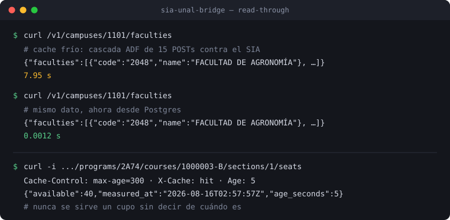
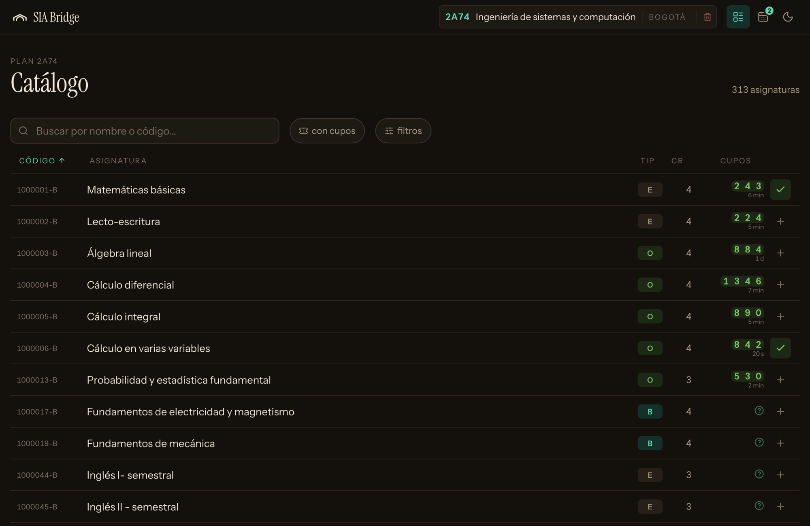
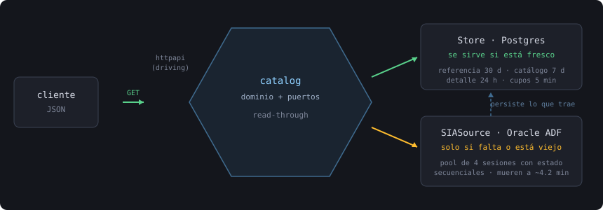
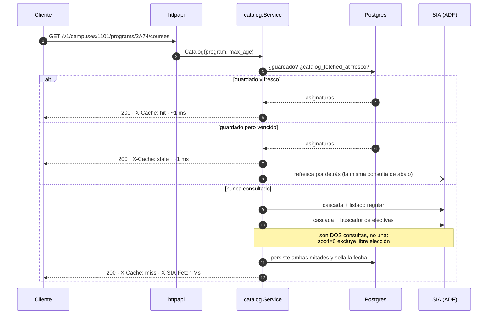

<div align="center">

<h1>
  <picture>
    <source media="(prefers-color-scheme: dark)" srcset="docs/assets/wordmark-dark.svg">
    
  </picture>
</h1>

**Una API JSON y una app web sobre un sistema universitario que nunca tuvo API.**

[English](README.md) · **Español**

**[sia.gabotachak.dev](https://sia.gabotachak.dev)** · API:
[sia-api.gabotachak.dev/v1/docs](https://sia-api.gabotachak.dev/v1/docs)

[](https://github.com/gabotachak/sia-unal-bridge/actions/workflows/ci.yml)
[](go.mod)
[](web/)
[](https://www.postgresql.org)
[](https://gin-gonic.com)
[](https://github.com/jackc/pgx)
[](https://docs.docker.com/compose/)
[](internal/httpapi/openapi.yaml)
[](docs/ARCH.md)
[](docs/GOTCHAS.md)
[](LICENSE)

</div>

---

<div align="center">
  
</div>

Los números son reales, medidos contra producción el 2026-08-15. La primera llamada
recorre una cascada ADF de 15 POSTs; la segunda sale de Postgres. **Solo un miss espera
al SIA.** El catálogo y la referencia vencidos se sirven al instante y se refrescan por
detrás; el detalle y los cupos, que sí cambian, se vuelven a consultar cuando caducan.

## Qué es esto

La [Universidad Nacional de Colombia](https://unal.edu.co) (UNAL) es la universidad
pública más grande del país: nueve sedes y decenas de miles de estudiantes. Cada
semestre, todos ellos consultan el mismo sitio para saber qué materias se ofrecen, en
qué horario, con qué profesor y cuántos cupos quedan: el **SIA** (Sistema de
Información Académica).

El SIA es una app Oracle ADF de hace años. No tiene API. Para ver los grupos de una
sola materia hay que elegir nivel, sede, facultad y plan en cuatro menús
encadenados, buscar, abrir el detalle y volver. Cada paso es un POST contra una sesión
que vive en el servidor y muere a los ~4 minutos. Armar un horario con eso es abrir
decenas de pestañas y anotar a mano.

**SIA Bridge hace dos cosas:**

1. **Una API REST** que hizo ingeniería inversa del protocolo ADF y lo traduce a JSON
   limpio, con cache en Postgres para que la mayoría de las respuestas salgan en
   milisegundos en vez de segundos.
2. **Una app web** sobre esa API para planear el semestre: explorar el catálogo de un
   plan, juntar materias, ver cupos en vivo, detectar choques de horario y exportar al
   calendario.

Si no conocés la UNAL, pensalo así: *una app vieja, con estado, sin API, que miles de
personas usan a la vez en la semana de inscripciones — y una capa que la vuelve
consultable como cualquier servicio moderno*.

## Qué hay acá

Tres piezas, un solo repo y un solo `docker compose`:

| | | |
|---|---|---|
| **API** | `cmd/bridge` + `internal/` | Traduce el ADF a JSON y lo cachea en Postgres. OpenAPI 3.1 servido en `/v1/docs` |
| **Interfaz** | [`web/`](web/) | React + TypeScript sobre esa API. Arma el semestre: catálogo, horario, cupos |
| **`Refresher`** | `cmd/refresher` | Barrido manual de la cache. Su cron se abandonó: la API sirve lo guardado y refresca detrás (ver `docs/FASE-2.md`) |

La interfaz **nunca** toca Postgres ni importa nada de `internal/`: habla la misma API
pública que cualquier otro cliente. Si algo se ve en pantalla, existe como endpoint.

## Arrancar

Los puertos del host salen del `.env` — `API_PORT`, `WEB_PORT`, `VITE_DEV_PORT`. Los
valores de abajo son los que trae [`.env.example`](.env.example); si los cambiás, ese
archivo manda.

```bash
cp .env.example .env
docker compose up -d db
make migrate
docker compose up -d --build api

curl localhost:18080/v1/campuses
open  localhost:18080/v1/docs      # Swagger UI sobre el contrato embebido
```

Con la interfaz, en modo desarrollo (Vite recarga en caliente y proxea `/v1` a la API):

```bash
docker compose up -d              # db + api
cd web && npm install && npm run dev   # → localhost:3000
```

O la interfaz como la sirve producción — nginx sobre los estáticos ya compilados:

```bash
docker compose up -d --build web  # → localhost:13000
```

El día a día —deploy, migraciones, qué versión corre dónde, cómo tirar todo abajo— está
en [`docs/COMMANDS.md`](docs/COMMANDS.md).

### Llenar la cache sin esperar a un cliente

El `Refresher` es la misma imagen con otro entrypoint: un modo por corrida, y sale. Su
checkpoint son los marcadores de frescura, así que **reanudar es volver a correr** y dos
corridas seguidas no hacen ni un POST.

```bash
docker compose --profile jobs run --rm refresher --mode=reference                 # niveles, sedes, planes: 131 POSTs, 72 s
docker compose --profile jobs run --rm refresher --mode=catalog --workers=2       # la lista de asignaturas de cada plan
docker compose --profile jobs run --rm refresher --mode=detail --scope=global \
                                  --workers=2 --max-duration=4h    # grupos, horarios y cupos
docker compose --profile jobs run --rm refresher --mode=seats --scope=hot         # calienta lo que la gente mira
```

Son corridas **manuales**: ya no hay cron ni cadencia (por qué, en
[`docs/FASE-2.md`](docs/FASE-2.md)). `REFRESH_ENABLED=false` las bloquea todas.
`GET /v1/status` cuenta qué hizo la última corrida de cada modo. Detalles y números medidos: [`docs/FASE-2.md`](docs/FASE-2.md).

## La interfaz

React + TypeScript, tres dependencias de runtime (React, React DOM y un set de
íconos), sin librería de estado ni de componentes — en [`web/`](web/). Arma el semestre:
catálogo por plan, ficha de asignatura con horario y grupos, "Mi semestre" para juntar
hasta veinte materias y medir sus cupos con un solo botón, y "Mi horario" con detección
de choques y exportación a calendario. Con doble titulación se eligen dos planes y se
arman en un solo horario.

Su tesis visual es la misma que la de la API: **todo dato declara su edad**. Los cupos
se muestran en un contador de tablero de estación, con su antigüedad envejeciendo a la
vista, y un miss frío no se esconde tras un spinner — se explica, con cronómetro.

<div align="center">
  
</div>

Cómo correrla, qué dependencia hace qué y por qué no hay más: [`web/README.es.md`](web/README.es.md).
El plan, con el curso mínimo de front para leerlo todo:
[`docs/PLAN-FRONTEND.md`](docs/PLAN-FRONTEND.md).

## La API

La **sede es un segmento obligatorio de la ruta**. No es un capricho: `program.code` no
identifica por sí solo — 136 de 852 códigos se repiten entre sedes porque PEAMA reexpone
el mismo plan. No hay default de sede, y no existe una URL que signifique "cualquiera".

| Método | Ruta | |
|---|---|---|
| `GET` | `/v1/levels` | niveles: pregrado, posgrado, doctorado (`soc1`) |
| `GET` | `/v1/campuses` | sedes (`soc9`) |
| `GET` | `/v1/campuses/{campus}/faculties` | |
| `GET` | `/v1/campuses/{campus}/programs?faculty=` | `faculty` es filtro opcional |
| `GET` | `/v1/campuses/{campus}/programs/{program}` | |
| `GET` | `…/programs/{program}/courses` | catálogo del plan; `?include=schedules` agrega los horarios |
| `GET` | `…/courses/{code}` | detalle con grupos |
| `GET` | `…/courses/{code}/sections` | |
| `GET` | `…/courses/{code}/sections/{key}` | `key`, no `number` |
| `GET` | `…/courses/{code}/sections/{key}/seats` | **cupos**, con su edad |
| `GET` | `/v1/campuses/{campus}/courses/{code}` | atajo; `300` si varios planes lo ofrecen |
| `GET` | `/v1/campuses/{campus}/courses?q=` | búsqueda; nunca consulta al SIA |
| `GET` | `/v1/healthz` · `/v1/status` · `/v1/version` | salud, cobertura de cache y build |
| `GET` | `/v1/docs` · `/v1/openapi.yaml` | Swagger UI y el contrato |

Esta tabla es para navegar. **El contrato que manda es**
[`internal/httpapi/openapi.yaml`](internal/httpapi/openapi.yaml) — OpenAPI 3.1, embebido
en el binario y servido en `/v1/docs`, así que la instancia que corre siempre describe su
propia versión. El *porqué* de cada decisión (IDs públicos, errores, frescura) está en
[`docs/API.md`](docs/API.md).

### Frescura

Un solo concepto: `?max_age=<segundos>`. `?max_age=0` fuerza la consulta al SIA.

| Recurso | Gobernado por |
|---|---|
| referencia — niveles, sedes, facultades, planes | `reference_fetch.fetched_at` |
| catálogo | `program.catalog_fetched_at` |
| detalle — grupos, horario, profesor | `course_program.detail_fetched_at` |
| **cupos** | `section.seats_checked_at` |

Los TTL por defecto viven en un solo sitio, [`internal/catalog/freshness.go`](internal/catalog/freshness.go),
y de ahí salen los de [`docs/API.md`](docs/API.md).

Cada respuesta lleva `Age`, `Cache-Control`, `X-Cache` y, en un miss, `X-SIA-Fetch-Ms`.
Los cupos además llevan `age_seconds` **en el body**: nunca se sirve un cupo sin decir de
cuándo es — y `changed_at`, que es cuándo el número cambió por última vez. Son dos
preguntas distintas: medido, 0 cambios en 347 grupos a lo largo de 35 min, así que el
historial solo crece cuando el cupo se mueve mientras la frescura se actualiza en cada
medición.

## Arquitectura

<div align="center">
  
</div>

Hexagonal. Dos puertos driving (`httpapi` y el `Refresher`), dos driven (`Store` sobre
Postgres, `SIASource` sobre ADF). El dominio no importa gin, ni pgx, ni goquery — y el
`Refresher` tampoco: entra por los mismos casos de uso que la API, así que hay un solo
camino de escritura a Postgres.



El árbol de paquetes y qué hace cada uno:
[`docs/LAYOUT.md`](docs/LAYOUT.md).

### `SIASource` no es un cliente HTTP

Es un **pool de sesiones ADF vivas**. Cada conexión:

- muere a los **~4.2 min** de inactividad — con ping ≤3 min vive indefinidamente
- es **estrictamente secuencial**: una petición en vuelo a la vez
- está parqueada en un `(nivel, sede, facultad, plan)`; moverla cuesta 2 POSTs
- está en el buscador **o** en una región de detalle **numerada**, cuyo número **sube**

El SIA aguanta bastante más paralelismo del que el pool usa; el pool se queda corto
porque el tráfico real no pide más, no porque el servidor imponga un techo bajo. El
número medido y cómo se midió están en [`docs/OPEN-QUESTIONS.md`](docs/OPEN-QUESTIONS.md) §5.

## Lo que no es obvio

Primero, el vocabulario del SIA que se cuela en la API:

- **Plan**: un programa de pregrado o posgrado, p. ej. `2A74` Ingeniería de Sistemas y
  Computación. En la API, `program`.
- **Grupo**: una oferta de una asignatura, con su horario, profesor y cupos. En la API,
  `section`.
- **Tipología**: cómo cuenta la asignatura para el plan: obligatoria, optativa, libre
  elección, etc.
- **PEAMA**: programa especial de admisión en el que el estudiante empieza en una sede
  de presencia nacional y termina en una sede andina. El SIA muestra sus planes y grupos
  junto a los regulares, y por eso los códigos chocan.

Estas cinco salen de medir contra el servidor, no de suponer:

| | |
|---|---|
| **El listado devuelve ofertas, no asignaturas** | Los códigos se repiten hasta ×131. Clave natural `(code, term, key)`, donde `key` es el token entre paréntesis — `Grupo N` se repite entre regulares y PEAMA |
| **Los grupos visibles dependen del plan** | Relación de subconjunto estricto. Pero **los cupos son globales**: una medición sirve para todos los planes |
| **La tipología depende del plan** | Probado: 8 códigos divergen entre planes de Bogotá. Vive en `course_program` |
| **El catálogo de un plan son dos consultas** | `soc4=0` significa literalmente *todas menos libre elección*. Las libres salen del buscador de electivas, que es por sede |
| **Una respuesta de ~900 B no es un error HTTP** | Es un no-op: falta un paso de la cascada, o caducó la sesión. Se trata como error explícito en vez de devolver datos incompletos |

Están todas, cada una verificada contra producción, en
[`docs/GOTCHAS.md`](docs/GOTCHAS.md). Varias fallan **en silencio**: devuelven datos
plausibles y equivocados.

## Documentación

**Antes de escribir código**

| | |
|---|---|
| [`docs/GOTCHAS.md`](docs/GOTCHAS.md) | **Las trampas verificadas. Léelo antes de tocar el código.** |
| [`docs/ARCH.md`](docs/ARCH.md) | Puertos, read-through, pool de sesiones, concurrencia |
| [`docs/DATA-MODEL.md`](docs/DATA-MODEL.md) | Esquema Postgres y las nueve decisiones no obvias |
| [`docs/LAYOUT.md`](docs/LAYOUT.md) | Árbol de paquetes Go y qué vive en cada uno |
| [`docs/COMMIT-CONVENTION.md`](docs/COMMIT-CONVENTION.md) | Formato de commits — `semantic-release` lo lee |

**El protocolo**

| | |
|---|---|
| [`docs/PROTOCOL.md`](docs/PROTOCOL.md) | Handshake ADF completo, con cuerpos reales |
| [`docs/FIELDS.md`](docs/FIELDS.md) | Componentes ADF y opciones de cada dropdown |
| [`docs/OPEN-QUESTIONS.md`](docs/OPEN-QUESTIONS.md) | Qué está probado y qué no |
| [`bruno/sia-catalogo/`](bruno/sia-catalogo/) | El flujo ADF crudo, a mano contra el SIA |

**El contrato y la interfaz**

| | |
|---|---|
| [`docs/API.md`](docs/API.md) | Contrato HTTP: IDs públicos, frescura, errores |
| [`bruno/bridge-api/`](bruno/bridge-api/) | La colección de esta API, endpoint por endpoint |
| [`web/README.es.md`](web/README.es.md) | La interfaz: cómo correrla y qué dependencia hace qué |
| [`docs/PLAN-FRONTEND.md`](docs/PLAN-FRONTEND.md) | Plan de la interfaz **+ curso mínimo de front** |

**Operación**

| | |
|---|---|
| [`docs/DEVELOPMENT.md`](docs/DEVELOPMENT.md) | Entorno local, fixtures, cómo replicar el flujo |
| [`docs/COMMANDS.md`](docs/COMMANDS.md) | Chuleta: deploy, migraciones, qué versión corre dónde |
| [`docs/internal/PLAN-CI-CD.md`](docs/internal/PLAN-CI-CD.md) | Deploy automático al mergear a `main`, versionado semver |
| [`docs/internal/PLAN-PRODUCTION.md`](docs/internal/PLAN-PRODUCTION.md) | Cómo esto pasa de localhost al server |

**Los planes**

| | |
|---|---|
| [`docs/PLAN.md`](docs/PLAN.md) | Fase 1: la API. Pasos y criterios de aceptación |
| [`docs/FASE-2.md`](docs/FASE-2.md) | Fase 2: el `Refresher`, concurrencia del crawl y cadencia |
| [`docs/PLAN-SIACHANGES.md`](docs/PLAN-SIACHANGES.md) | Reconciliar lo que el SIA deja de ofrecer |
| [`docs/PLAN-DOUBLE-TITULATION.md`](docs/PLAN-DOUBLE-TITULATION.md) | Doble titulación: dos planes en un solo horario (solo front) |

## Verificar contra el servidor

Los IDs de componente ADF (`pt1:r1:0:soc1`, …) son frágiles por diseño y cambian si la
UNAL repinta la página. La colección [`bruno/sia-catalogo/`](bruno/sia-catalogo/) ejecuta
el flujo completo a mano:

- si la colección funciona y tu código no, el problema es tuyo
- si la colección tampoco, el SIA cambió y toca re-mapear con
  [`docs/FIELDS.md`](docs/FIELDS.md)

Las pruebas contra el servidor real están detrás de una variable, nunca en `go test ./...`:

```bash
SIA_LIVE=1 go test ./internal/sia/ -run TestLive -v
```

## Convención de idioma

**Código en inglés** — identificadores, tipos, columnas, endpoints, comentarios.
**Documentación en español**, salvo el [`README.md`](README.md), que está en inglés
para quien llega sin contexto; este archivo es su versión en español. Los literales
que vienen del SIA se conservan tal cual (`Cupos disponibles:`, `LIBRE ELECCIÓN (L)`,
`MIÉRCOLES de 09:00 a 11:00.`): son datos, no texto nuestro.

## Fuente

```
https://sia.unal.edu.co/Catalogo/facespublico/public/servicioPublico.jsf
    ?taskflowId=task-flow-AC_CatalogoAsignaturas
```

Catálogo público, sin autenticación. No hay `robots.txt` (404).

## Aviso

Proyecto independiente. **No está afiliado ni avalado por la Universidad Nacional de
Colombia.** Solo consulta el catálogo público del SIA, sin autenticación, y cachea lo
que devuelve para no cargarlo de más. La fuente de verdad sigue siendo el SIA: ante
cualquier diferencia, manda lo que diga el SIA.

## Licencia

[MIT](LICENSE).
