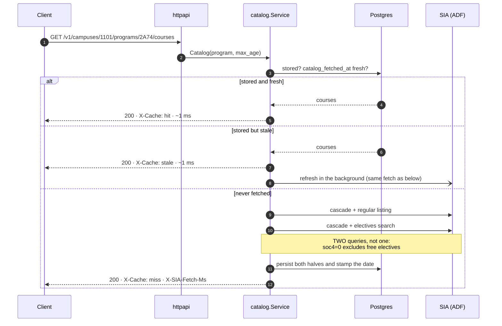

<div align="center">

<h1>
  
</h1>

**A JSON API and a web app on top of a university system that never had an API.**

**English** · [Español](README.es.md)

**[sia.gabotachak.dev](https://sia.gabotachak.dev)** · API:
[sia-api.gabotachak.dev/v1/docs](https://sia-api.gabotachak.dev/v1/docs)

[](https://github.com/gabotachak/sia-unal-bridge/actions/workflows/ci.yml)
[](go.mod)
[](web/)
[](https://www.postgresql.org)
[](https://gin-gonic.com)
[](https://github.com/jackc/pgx)
[](https://docs.docker.com/compose/)
[](internal/httpapi/openapi.yaml)
[](docs/ARCH.md)
[](docs/GOTCHAS.md)
[](LICENSE)

</div>

---

<div align="center">
  
</div>

## What this is

The [Universidad Nacional de Colombia](https://unal.edu.co) (UNAL) is Colombia's largest
public university: nine campuses and tens of thousands of students. Every semester, all
of them go to the same website to find out which courses are offered, when they meet,
who teaches them and how many seats are left. That website is the **SIA** (*Sistema de
Información Académica*, the university's student information system).

The SIA is an aging Oracle ADF web application, and it has no API. To see the sections of
a single course you pick a level, a campus, a faculty and a degree program from four
chained dropdowns, run a search, open the course detail and navigate back. Every step is
a form POST against a session that lives on the server and dies after about four minutes
of inactivity. Planning a timetable with it means dozens of browser tabs and a notepad.

**SIA Bridge does two things:**

1. **A REST API** that reverse-engineers the ADF protocol and turns it into clean JSON,
   with a Postgres cache so most answers take milliseconds instead of seconds.
2. **A web app** on top of that API for planning a semester: browse a program's
   catalog, collect courses, check live seat counts, detect schedule clashes and export
   the result to your calendar.

If you have never heard of UNAL, think of it this way: *a legacy, stateful web app with
no API, hammered by thousands of people at once during enrollment week, and a layer that
makes it queryable like any modern service.*

The numbers in the animation above are real, measured against production on
2026-08-15. The first call walks a 15-POST ADF cascade; the second is served from
Postgres. **Only a cache miss waits for the SIA.** Stale catalog and reference data is
served instantly and refreshed in the background; course details and seat counts, which
actually change, are re-fetched when they expire.

## What makes it interesting

- **Reverse engineering a stateful protocol.** Oracle ADF keeps all UI state on the
  server. The bridge replays the exact sequence of partial-page POSTs a browser would
  send, parses XML envelopes with embedded HTML, and knows which responses are silent
  no-ops rather than errors. Every quirk is written down and verified against the live
  server in [`docs/GOTCHAS.md`](docs/GOTCHAS.md) (in Spanish).
- **A pool of live sessions, not an HTTP client.** Each upstream connection is a
  long-lived, strictly sequential ADF session "parked" on a specific program. The pool
  keeps them alive, reuses the ones already positioned where a request needs them (2
  POSTs instead of 6), and was load-tested against production to find the concurrency
  ceiling.
- **Caching tuned to how the data changes.** A program's catalog barely changes and
  costs one upstream request for ~100 courses, so it is served stale-while-revalidate.
  Seat counts change by the minute and are fetched one course at a time, so every seat
  count in the API says how old it is.
- **Hexagonal architecture.** The domain imports neither the HTTP framework, nor the
  database driver, nor the HTML parser. The API and the batch refresher go through the
  same use cases, so there is a single write path to Postgres.

## What's in here

Three pieces, one repo, one `docker compose`:

| | | |
|---|---|---|
| **API** | `cmd/bridge` + `internal/` | Translates ADF into JSON and caches it in Postgres. OpenAPI 3.1 served at `/v1/docs` |
| **Web app** | [`web/`](web/) | React + TypeScript on top of that API. Plans the semester: catalog, timetable, seats |
| **`Refresher`** | `cmd/refresher` | Manual cache sweep. No longer on a cron: the API serves what it has and refreshes in the background (see `docs/FASE-2.md`) |

The web app **never** touches Postgres or imports anything from `internal/`: it talks to
the same public API as any other client. If something is on screen, it exists as an
endpoint.

## Getting started

Host ports come from `.env` (`API_PORT`, `WEB_PORT`, `VITE_DEV_PORT`). The values below
are the defaults in [`.env.example`](.env.example); if you change them, that file wins.

```bash
cp .env.example .env
docker compose up -d db
make migrate
docker compose up -d --build api

curl localhost:18080/v1/campuses
open  localhost:18080/v1/docs      # Swagger UI over the embedded contract
```

The web app in development mode (Vite hot reload, proxying `/v1` to the API):

```bash
docker compose up -d              # db + api
cd web && npm install && npm run dev   # → localhost:3000
```

Or the web app as production serves it, nginx over the compiled static files:

```bash
docker compose up -d --build web  # → localhost:13000
```

Day-to-day operations (deploys, migrations, which version runs where, tearing everything
down) are in [`docs/COMMANDS.md`](docs/COMMANDS.md).

### Warming the cache without waiting for a client

The `Refresher` is the same image with another entrypoint: one mode per run, then it
exits. Its checkpoint is the freshness markers themselves, so **resuming means running
it again**, and two back-to-back runs make zero upstream requests.

```bash
docker compose --profile jobs run --rm refresher --mode=reference                 # levels, campuses, programs: 131 POSTs, 72 s
docker compose --profile jobs run --rm refresher --mode=catalog --workers=2       # every program's course list
docker compose --profile jobs run --rm refresher --mode=detail --scope=global \
                                  --workers=2 --max-duration=4h    # sections, schedules and seats
docker compose --profile jobs run --rm refresher --mode=seats --scope=hot         # warms what people look at
```

These runs are **manual**: there is no cron and no cadence anymore (the reasoning is in
[`docs/FASE-2.md`](docs/FASE-2.md)). `REFRESH_ENABLED=false` blocks all of them.
`GET /v1/status` reports what the last run of each mode did.

## The web app

React + TypeScript, three runtime dependencies (React, React DOM and an icon set), no
state or component library, in [`web/`](web/). It plans the semester: a program's
catalog, a course page with schedule and sections, "Mi semestre" to collect up to twenty
courses and measure all their seats with one button, and "Mi horario" with clash
detection and calendar export. Students pursuing a double degree can pick two programs
and plan both in a single timetable.

Its visual thesis is the same as the API's: **every piece of data states its age**. Seat
counts are shown on a split-flap style counter whose age visibly ticks up, and a cold
cache miss is not hidden behind a spinner: it is explained, with a stopwatch.

<div align="center">
  
</div>

How to run it, and what each dependency does: [`web/README.md`](web/README.md). The
plan, including a crash course in frontend for reading it:
[`docs/PLAN-FRONTEND.md`](docs/PLAN-FRONTEND.md).

## The API

**The campus is a mandatory path segment.** A program code does not identify a program
on its own: 136 of 852 codes repeat across campuses. There is no default campus and no
URL that means "any campus".

| Method | Path | |
|---|---|---|
| `GET` | `/v1/levels` | academic levels (undergraduate, master's, doctorate) |
| `GET` | `/v1/campuses` | campuses |
| `GET` | `/v1/campuses/{campus}/faculties` | |
| `GET` | `/v1/campuses/{campus}/programs?faculty=` | `faculty` is an optional filter |
| `GET` | `/v1/campuses/{campus}/programs/{program}` | |
| `GET` | `…/programs/{program}/courses` | the program's catalog; `?include=schedules` adds timetables |
| `GET` | `…/courses/{code}` | course detail with sections |
| `GET` | `…/courses/{code}/sections` | |
| `GET` | `…/courses/{code}/sections/{key}` | `key`, not `number` |
| `GET` | `…/courses/{code}/sections/{key}/seats` | **seats**, with their age |
| `GET` | `/v1/campuses/{campus}/courses/{code}` | shortcut; `300` if several programs offer it |
| `GET` | `/v1/campuses/{campus}/courses?q=` | search; never hits the SIA |
| `GET` | `/v1/healthz` · `/v1/status` · `/v1/version` | health, cache coverage and build |
| `GET` | `/v1/docs` · `/v1/openapi.yaml` | Swagger UI and the contract |

This table is for orientation. **The contract that rules is**
[`internal/httpapi/openapi.yaml`](internal/httpapi/openapi.yaml): OpenAPI 3.1, embedded
in the binary and served at `/v1/docs`, so a running instance always describes its own
version. The *why* behind each decision (public IDs, errors, freshness) is in
[`docs/API.md`](docs/API.md).

### Freshness

One concept: `?max_age=<seconds>`. `?max_age=0` forces a trip to the SIA.

| Resource | Governed by |
|---|---|
| reference data: levels, campuses, faculties, programs | `reference_fetch.fetched_at` |
| catalog | `program.catalog_fetched_at` |
| detail: sections, schedule, instructor | `course_program.detail_fetched_at` |
| **seats** | `section.seats_checked_at` |

Default TTLs live in one place,
[`internal/catalog/freshness.go`](internal/catalog/freshness.go).

Every response carries `Age`, `Cache-Control`, `X-Cache` and, on a miss,
`X-SIA-Fetch-Ms`. Seat counts also carry `age_seconds` **in the body**: a seat count is
never served without saying when it was taken. They also carry `changed_at`, the last
time the number actually moved. Those are two different questions: measured, 347
sections showed zero changes over 35 minutes, so history only grows when seats move,
while freshness updates on every measurement.

## Architecture

<div align="center">
  
</div>

Hexagonal. Two driving ports (`httpapi` and the `Refresher`), two driven ports (`Store`
over Postgres, `SIASource` over ADF). The domain imports neither gin, nor pgx, nor
goquery, and neither does the `Refresher`: it enters through the same use cases as the
API, so there is a single write path to Postgres.



The package tree and what each package does: [`docs/LAYOUT.md`](docs/LAYOUT.md).

### `SIASource` is not an HTTP client

It is a **pool of live ADF sessions**. Each connection:

- dies after **~4.2 min** of inactivity; pinged every ≤3 min it lives indefinitely
- is **strictly sequential**: one request in flight at a time
- is parked on a `(level, campus, faculty, program)`; moving it costs 2 POSTs
- is either on the search page **or** on a **numbered** detail region, whose number
  **keeps increasing**

The SIA tolerates much more parallelism than the pool uses; the pool stays small because
real traffic doesn't need more, not because the server imposes a low ceiling. The
measured number and how it was measured are in
[`docs/OPEN-QUESTIONS.md`](docs/OPEN-QUESTIONS.md) §5.

## What isn't obvious

A few terms first, since the SIA's vocabulary leaks into the API:

- **Program** (*plan*): a degree program, e.g. `2A74` Systems and Computing Engineering.
- **Section** (*grupo*): one offering of a course, with its own schedule, instructor and
  seats.
- **Typology** (*tipología*): how a course counts toward a degree: required, elective,
  free elective, etc.
- **PEAMA**: a special admission program in which students start at a remote campus and
  finish at a larger one. The SIA shows its programs and sections next to the regular
  ones, which is why codes collide.

These five come from measuring against the server, not from assuming:

| | |
|---|---|
| **The listing returns offerings, not courses** | Codes repeat up to ×131. Natural key `(code, term, key)`, where `key` is the token in parentheses: `Grupo N` repeats between regular and PEAMA sections |
| **Visible sections depend on the program** | A strict subset relation. But **seats are global**: one measurement serves every program |
| **Course type depends on the program** | Proven: 8 codes differ between Bogotá programs. It lives in `course_program` |
| **A program's catalog is two queries** | `soc4=0` literally means *everything except free electives*. Free electives come from the electives search, which is per campus |
| **A ~900 B response is not an HTTP error** | It is a no-op: a cascade step is missing, or the session expired. It is treated as an explicit error instead of returning incomplete data |

All of them, each verified against production, are in
[`docs/GOTCHAS.md`](docs/GOTCHAS.md). Several fail **silently**: they return plausible
but wrong data.

## Documentation

The rest of the documentation is in **Spanish**.

**Before writing code**

| | |
|---|---|
| [`docs/GOTCHAS.md`](docs/GOTCHAS.md) | **The verified traps. Read it before touching the code.** |
| [`docs/ARCH.md`](docs/ARCH.md) | Ports, read-through, session pool, concurrency |
| [`docs/DATA-MODEL.md`](docs/DATA-MODEL.md) | Postgres schema and the nine non-obvious decisions |
| [`docs/LAYOUT.md`](docs/LAYOUT.md) | Go package tree and what lives in each package |
| [`docs/COMMIT-CONVENTION.md`](docs/COMMIT-CONVENTION.md) | Commit format: `semantic-release` reads it |

**The protocol**

| | |
|---|---|
| [`docs/PROTOCOL.md`](docs/PROTOCOL.md) | Full ADF handshake, with real request bodies |
| [`docs/FIELDS.md`](docs/FIELDS.md) | ADF components and the options of each dropdown |
| [`docs/OPEN-QUESTIONS.md`](docs/OPEN-QUESTIONS.md) | What is proven and what isn't |
| [`bruno/sia-catalogo/`](bruno/sia-catalogo/) | The raw ADF flow, by hand against the SIA |

**The contract and the web app**

| | |
|---|---|
| [`docs/API.md`](docs/API.md) | HTTP contract: public IDs, freshness, errors |
| [`bruno/bridge-api/`](bruno/bridge-api/) | This API's collection, endpoint by endpoint |
| [`web/README.md`](web/README.md) | The web app: how to run it and what each dependency does |
| [`docs/PLAN-FRONTEND.md`](docs/PLAN-FRONTEND.md) | Web app plan **+ a frontend crash course** |

**Operations**

| | |
|---|---|
| [`docs/DEVELOPMENT.md`](docs/DEVELOPMENT.md) | Local environment, fixtures, reproducing the flow |
| [`docs/COMMANDS.md`](docs/COMMANDS.md) | Cheat sheet: deploys, migrations, which version runs where |
| [`docs/internal/PLAN-CI-CD.md`](docs/internal/PLAN-CI-CD.md) | Automatic deploy on merge to `main`, semver versioning |
| [`docs/internal/PLAN-PRODUCTION.md`](docs/internal/PLAN-PRODUCTION.md) | How this went from localhost to a server |

**The plans**

| | |
|---|---|
| [`docs/PLAN.md`](docs/PLAN.md) | Phase 1: the API. Steps and acceptance criteria |
| [`docs/FASE-2.md`](docs/FASE-2.md) | Phase 2: the `Refresher`, crawl concurrency and cadence |
| [`docs/PLAN-SIACHANGES.md`](docs/PLAN-SIACHANGES.md) | Reconciling what the SIA stops offering |
| [`docs/PLAN-DOUBLE-TITULATION.md`](docs/PLAN-DOUBLE-TITULATION.md) | Double degree: two programs in one timetable (frontend only) |

## Verifying against the server

ADF component IDs (`pt1:r1:0:soc1`, …) are fragile by design and change if the
university redesigns the page. The [`bruno/sia-catalogo/`](bruno/sia-catalogo/)
collection runs the full flow by hand:

- if the collection works and your code doesn't, the problem is yours
- if the collection fails too, the SIA changed and it's time to re-map with
  [`docs/FIELDS.md`](docs/FIELDS.md)

Tests against the real server sit behind an environment variable, never in
`go test ./...`:

```bash
SIA_LIVE=1 go test ./internal/sia/ -run TestLive -v
```

## Language convention

**Code in English**: identifiers, types, columns, endpoints, comments. **Documentation
in Spanish**, except this README, which is in English for readers arriving without
context; [`README.es.md`](README.es.md) is its Spanish version. Literals coming from the
SIA are kept verbatim (`Cupos disponibles:`, `LIBRE ELECCIÓN (L)`,
`MIÉRCOLES de 09:00 a 11:00.`): they are data, not our text.

## Source

```
https://sia.unal.edu.co/Catalogo/facespublico/public/servicioPublico.jsf
    ?taskflowId=task-flow-AC_CatalogoAsignaturas
```

Public catalog, no authentication. There is no `robots.txt` (404).

## Disclaimer

Independent project. **Not affiliated with or endorsed by the Universidad Nacional de
Colombia.** It only reads the SIA's public catalog, without authentication, and caches
what it returns to avoid putting extra load on it. The SIA remains the source of truth:
if anything differs, the SIA is right.

## License

[MIT](LICENSE).
