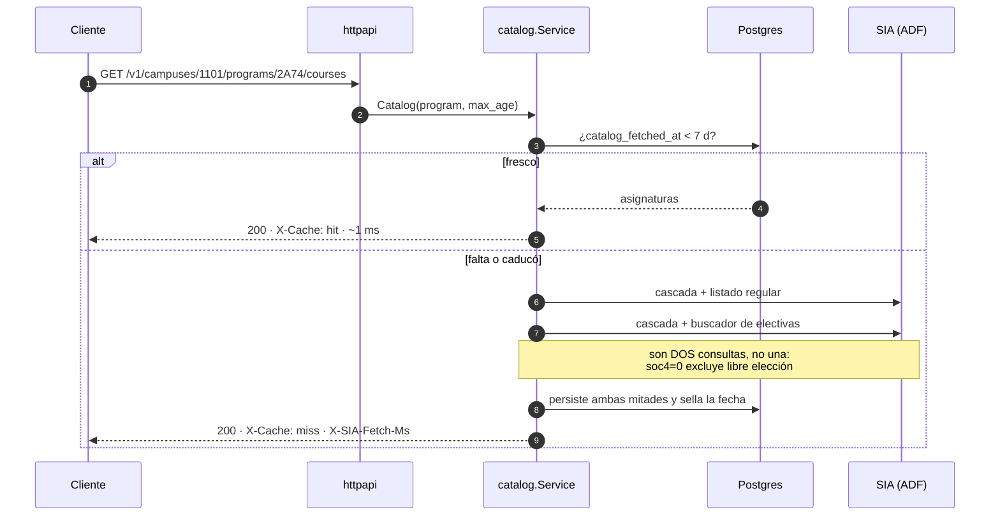

<div align="center">

# sia-unal-bridge

**El catálogo de asignaturas de la Universidad Nacional de Colombia, en JSON.**

El SIA solo lo expone a través de una app Oracle ADF con estado de sesión en servidor,
navegación por POSTs de formulario encadenados y respuestas en XML con HTML incrustado.
No hay API pública. Esto la construye.

[](https://go.dev)
[](https://www.postgresql.org)
[](https://gin-gonic.com)
[](https://github.com/jackc/pgx)
[](https://docs.docker.com/compose/)
[](internal/httpapi/openapi.yaml)
[](docs/ARCH.md)
[](docs/GOTCHAS.md)

</div>

---

<div align="center">
  
</div>

Los números son reales, medidos contra producción el 2026-08-15. La primera llamada
recorre una cascada ADF de 15 POSTs; la segunda sale de Postgres. **Ir al SIA solo pasa
si el dato falta o caducó** — salvo los cupos, que tienen su propio TTL de 5 minutos y
al refrescarse guardan el grupo completo.

## Arrancar

```bash
cp .env.example .env
docker compose up -d db
make migrate
docker compose up -d --build api

curl localhost:8080/v1/campuses
open  localhost:8080/v1/docs      # Swagger UI
```

### Llenar la cache sin esperar a un cliente

El `Refresher` es la misma imagen con otro entrypoint: un modo por corrida, y sale. Su
checkpoint son los marcadores de frescura, así que **reanudar es volver a correr** y dos
corridas seguidas no hacen ni un POST.

```bash
docker compose --profile jobs run --rm refresher --mode=reference                 # niveles, sedes, planes: 131 POSTs, 72 s
docker compose --profile jobs run --rm refresher --mode=catalog --workers=2       # la lista de asignaturas de cada plan
docker compose --profile jobs run --rm refresher --mode=detail --scope=global \
                                  --workers=2 --max-duration=4h    # grupos, horarios y cupos
docker compose --profile jobs run --rm refresher --mode=seats --scope=hot         # calienta lo que la gente mira
```

La cadencia va en [`deploy/cron.d/sia-refresher`](deploy/cron.d/sia-refresher);
`REFRESH_ENABLED=false` lo apaga todo sin editar cron. `GET /v1/status` cuenta qué hizo la
última corrida de cada modo. Detalles y números medidos: [`docs/FASE-2.md`](docs/FASE-2.md).

## Arquitectura

<div align="center">
  
</div>

Hexagonal. Dos puertos driving (`httpapi` y el `Refresher` de la fase 2), dos driven
(`Store` sobre Postgres, `SIASource` sobre ADF). El dominio no importa gin, ni pgx, ni
goquery — y el `Refresher` tampoco: entra por los mismos casos de uso que la API, así que
hay un solo camino de escritura a Postgres.



### `SIASource` no es un cliente HTTP

Es un **pool de sesiones ADF vivas**. Cada conexión:

- muere a los **~4.2 min** de inactividad — con ping ≤3 min vive indefinidamente
- es **estrictamente secuencial**: una petición en vuelo a la vez
- está parqueada en un `(nivel, sede, facultad, plan)`; moverla cuesta 2 POSTs
- está en el buscador **o** en una región de detalle **numerada**, cuyo número **sube**

Medido: el SIA aguanta 8 sesiones en paralelo sin errores ni throttling. El pool usa 4
por cortesía.

## La API

La **sede es un segmento obligatorio de la ruta**. No es un capricho: `program.code` no
identifica por sí solo — 136 de 852 códigos se repiten entre sedes porque PEAMA reexpone
el mismo plan. No hay default de sede, y no existe una URL que signifique "cualquiera".

| Método | Ruta | |
|---|---|---|
| `GET` | `/v1/levels` | niveles (`soc1`) |
| `GET` | `/v1/campuses` | sedes (`soc9`) |
| `GET` | `/v1/campuses/{campus}/faculties` | |
| `GET` | `/v1/campuses/{campus}/programs?faculty=` | `faculty` es filtro opcional |
| `GET` | `/v1/campuses/{campus}/programs/{program}` | |
| `GET` | `…/programs/{program}/courses` | catálogo del plan |
| `GET` | `…/courses/{code}` | detalle con grupos |
| `GET` | `…/courses/{code}/sections` | |
| `GET` | `…/courses/{code}/sections/{key}` | `key`, no `number` |
| `GET` | `…/courses/{code}/sections/{key}/seats` | **cupos**, con su edad |
| `GET` | `/v1/campuses/{campus}/courses/{code}` | atajo; `300` si varios planes lo ofrecen |
| `GET` | `/v1/campuses/{campus}/courses?q=` | búsqueda; nunca consulta al SIA |
| `GET` | `/v1/docs` · `/v1/openapi.yaml` | Swagger UI y el contrato |

Contrato completo: [`internal/httpapi/openapi.yaml`](internal/httpapi/openapi.yaml)
(OpenAPI 3.1, embebido en el binario y servido en `/v1/docs`).

### Frescura

Un solo concepto: `?max_age=<segundos>`. `?max_age=0` fuerza la consulta al SIA.

| Recurso | Default | Gobernado por |
|---|---|---|
| referencia — niveles, sedes, facultades, planes | 30 d | `reference_fetch.fetched_at` |
| catálogo | 7 d | `program.catalog_fetched_at` |
| detalle — grupos, horario, profesor | 24 h | `course_program.detail_fetched_at` |
| **cupos** | **5 min** | `section.seats_checked_at` |

Cada respuesta lleva `Age`, `Cache-Control`, `X-Cache` y, en un miss, `X-SIA-Fetch-Ms`.
Los cupos además llevan `age_seconds` **en el body**: nunca se sirve un cupo sin decir de
cuándo es — y `changed_at`, que es cuándo el número cambió por última vez. Son dos
preguntas distintas: medido, 0 cambios en 347 grupos a lo largo de 35 min, así que el
historial solo crece cuando el cupo se mueve mientras la frescura se actualiza en cada
medición.

## La interfaz

Una app de lectura sobre esta API, en [`web/`](web/). React + TypeScript, cuatro
dependencias directas, sin librería de estado ni de componentes.

```bash
docker compose up -d      # db + api
cd web && npm install && npm run dev   # → localhost:5173
```

Su tesis visual es la misma que la de la API: **todo dato declara su edad**. Los cupos
se muestran en un contador de tablero de estación, con su antigüedad envejeciendo a la
vista, y un miss frío no se esconde tras un spinner — se explica, con cronómetro.

## Lo que no es obvio

Estas cinco salen de medir contra el servidor, no de suponer:

| | |
|---|---|
| **El listado devuelve ofertas, no asignaturas** | Los códigos se repiten hasta ×131. Clave natural `(code, term, key)`, donde `key` es el token entre paréntesis — `Grupo N` se repite entre regulares y PEAMA |
| **Los grupos visibles dependen del plan** | Relación de subconjunto estricto. Pero **los cupos son globales**: una medición sirve para todos los planes |
| **La tipología depende del plan** | Probado: 8 códigos divergen entre planes de Bogotá. Vive en `course_program` |
| **El catálogo de un plan son dos consultas** | `soc4=0` significa literalmente *todas menos libre elección*. Las libres salen del buscador de electivas, que es por sede |
| **Una respuesta de ~900 B no es un error HTTP** | Es un no-op: falta un paso de la cascada, o caducó la sesión. Se trata como error explícito en vez de devolver datos incompletos |

Las 36 completas, cada una verificada contra producción, en
[`docs/GOTCHAS.md`](docs/GOTCHAS.md). Varias fallan **en silencio**: devuelven datos
plausibles y equivocados.

## Documentación

| | |
|---|---|
| [`docs/GOTCHAS.md`](docs/GOTCHAS.md) | **Las 39 trampas. Léelo antes de tocar el código.** |
| [`docs/ARCH.md`](docs/ARCH.md) | Puertos, read-through, pool de sesiones, concurrencia |
| [`docs/API.md`](docs/API.md) | Contrato HTTP: IDs públicos, frescura, errores |
| [`docs/DATA-MODEL.md`](docs/DATA-MODEL.md) | Esquema Postgres y las nueve decisiones no obvias |
| [`docs/PROTOCOL.md`](docs/PROTOCOL.md) | Handshake ADF completo, con cuerpos reales |
| [`docs/FIELDS.md`](docs/FIELDS.md) | Componentes ADF y opciones de cada dropdown |
| [`docs/LAYOUT.md`](docs/LAYOUT.md) | Árbol de paquetes Go y librerías |
| [`docs/PLAN.md`](docs/PLAN.md) | Plan de implementación y criterios de aceptación |
| [`docs/FASE-2.md`](docs/FASE-2.md) | Fase 2: el `Refresher`, concurrencia del crawl y cada cuánto correrlo |
| [`docs/PLAN-FRONTEND.md`](docs/PLAN-FRONTEND.md) | Plan de la interfaz **+ curso mínimo de front** |
| [`docs/OPEN-QUESTIONS.md`](docs/OPEN-QUESTIONS.md) | Qué está probado y qué no |
| [`docs/DEVELOPMENT.md`](docs/DEVELOPMENT.md) | Entorno, fixtures, cómo replicar el flujo |
| [`bruno/sia-catalogo/`](bruno/sia-catalogo/) | El flujo ADF crudo, a mano contra el SIA |
| [`bruno/bridge-api/`](bruno/bridge-api/) | Los 14 endpoints de esta API |
| [`web/`](web/) | La interfaz: React + TypeScript sobre esta API |

## Verificar contra el servidor

Los IDs de componente ADF (`pt1:r1:0:soc1`, …) son frágiles por diseño y cambian si la
UNAL repinta la página. La colección [`bruno/sia-catalogo/`](bruno/sia-catalogo/) ejecuta
el flujo completo a mano:

- si la colección funciona y tu código no, el problema es tuyo
- si la colección tampoco, el SIA cambió y toca re-mapear con
  [`docs/FIELDS.md`](docs/FIELDS.md)

Las pruebas contra el servidor real están detrás de una variable, nunca en `go test ./...`:

```bash
SIA_LIVE=1 go test ./internal/sia/ -run TestLive -v
```

## Convención de idioma

**Código en inglés** — identificadores, tipos, columnas, endpoints, comentarios.
**Documentación en español.** Los literales que vienen del SIA se conservan tal cual
(`Cupos disponibles:`, `LIBRE ELECCIÓN (L)`, `MIÉRCOLES de 09:00 a 11:00.`): son datos,
no texto nuestro.

## Fuente

```
https://sia.unal.edu.co/Catalogo/facespublico/public/servicioPublico.jsf
    ?taskflowId=task-flow-AC_CatalogoAsignaturas
```

Catálogo público, sin autenticación. No hay `robots.txt` (404).
