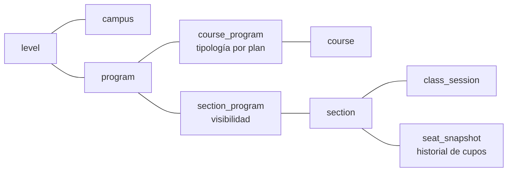
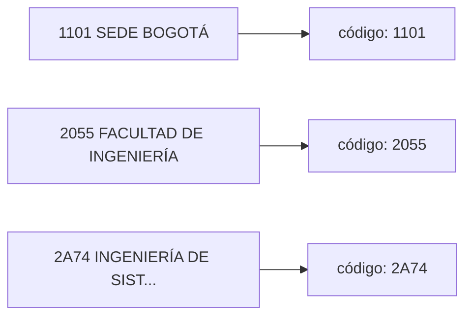

# Modelo de datos

Postgres. **El esquema que corre es la suma de [`../migrations/`](../migrations/)**; los
structs están en `internal/catalog`. Este documento no los transcribe: explica las
decisiones que no son obvias leyendo el DDL. Cada una sale de algo verificado contra el
servidor ([GOTCHAS.md](GOTCHAS.md)).



Tablas de apoyo, sin relaciones de dominio:

| Tabla | Qué guarda |
|---|---|
| `reference_fetch` | el sello de TTL de cada lista de referencia |
| `course_demand` | cuántas veces pidió un cliente cada asignatura |
| `refresh_run` | la bitácora del `Refresher` |

El diagrama entidad-relación con las columnas clave está en
[diagram.md](diagram.md#19-modelo-de-datos).

---

## Las decisiones no obvias

Los comentarios del código citan estas decisiones por número.

### 1. `typology` vive en `course_program`, no en `course`

La tipología es relativa al plan: el mismo código es `FUND. OBLIGATORIA (B)` en un plan y
`FUND. OPTATIVA (O)` en otro. Colgada de `course`, cada plan la sobrescribiría
([GOTCHAS §17](GOTCHAS.md)).

### 2. `section` es global; `section_program` es la visibilidad

Los grupos existen una vez (mismo profesor, horario, aula y cupos), pero cada plan ve un
subconjunto estricto ([GOTCHAS §16](GOTCHAS.md)). Por eso los grupos viven en `section` y
qué plan ve cuál vive en `section_program`.

Consecuencia: una sola medición de cupos sirve para todos los planes. `seat_snapshot`
cuelga de `section`, no de `(section, program)`.

### 3. El listado se dedupea por código al parsear

Las filas repetidas del listado tienen las mismas columnas y un detalle idéntico: son
emparejamientos asignatura × plan, no grupos distintos ([GOTCHAS §13](GOTCHAS.md)).

### 4. Cuándo se midió un cupo no es cuándo cambió

| Pregunta | Columna | Quién la usa |
|---|---|---|
| ¿Cuándo se **miró**? | `section.seats_checked_at`, en cada medición | frescura, `measured_at`, `age_seconds` |
| ¿Cuándo **cambió**? | `max(seat_snapshot.measured_at)` | historial, `changed_at` |

`seat_snapshot` es append-only y **solo crece cuando el número cambia**: los cupos casi
nunca cambian, e insertar en cada medición llenaría la tabla de filas repetidas. Pero la
frescura no puede depender de ese insert: si no se insertara nada, el dato parecería viejo
y el read-through lo volvería a pedir. Por eso las dos columnas.

### 5. Dos caches con granularidad distinta

| Cache | Granularidad | Marcador |
|---|---|---|
| catálogo | por programa: un POST trae el plan entero | `program.catalog_fetched_at` |
| detalle y cupos | por asignatura: un POST por asignatura | `course_program.detail_fetched_at`, `section.seats_checked_at` |

### 6. Un hit de detalle es por `(code, program)`, no por `code`

El detalle guardado tiene dos capas con validez distinta:

| Capa | Válida para | Marcador |
|---|---|---|
| filas de `section`: profesor, horario, aula, cupos | **todos** los planes | `section.fetched_at`, `section.seats_checked_at` |
| `section_program`: qué grupos ve este plan | **solo** los planes que ya preguntaron | `course_program.detail_fetched_at` |

Si un plan pide una asignatura que otro plan ya trajo, en la base están todos los grupos
que **podría** ver, pero no cuáles ve. Servirlos todos es el fallo silencioso que este
proyecto evita: el estudiante intentaría inscribir un grupo que su plan no habilita. Por
eso un plan nuevo paga el POST.

### 7. El ID público es el código institucional, no el índice del dropdown

`soc3=3` es una **posición** en un `<select>`: si la UNAL inserta una carrera, apunta a
otra sin error ([GOTCHAS §26](GOTCHAS.md)). Cada etiqueta trae el código delante, y ese sí
es estable:



| Entidad | Identidad |
|---|---|
| `campus` | `(level_slug, code)` |
| `program` | `(campus_code, faculty_code, code, level_slug)`: el código **se repite** entre sedes (PEAMA) y entre facultades de una sede |
| `course` | `(campus_code, code)`: no está verificado que el código sea único entre sedes, y esta clave es la apuesta segura |
| `section` | `(campus_code, code, term, key)` |

Los índices (`*_idx`) se guardan junto a la identidad, pero solo para navegar. Se
refrescan con la referencia y nunca aparecen en una URL.

### 8. La identidad de un grupo es el token entre paréntesis, no `Grupo N`

Una asignatura tiene grupos regulares y PEAMA de otras sedes, y la numeración se repite
entre ellos:

```
1000004-B  Cálculo diferencial
  (1) Grupo 1
  (AMAZ-01) Peama-Amazonia Grupo 1     ← number = 1 otra vez
  (TUMA-01) Peama - Tumaco - Grupo 1   ← y otra
```

Con `number` en la clave, esos grupos se sobrescriben unos a otros. La clave es `key`, el
token entre paréntesis. `number` se guarda porque es lo que el estudiante lee. `site`
(`AMAZ`, `TUMA`…) sale del mismo token ([GOTCHAS §24, §27](GOTCHAS.md)).

### 9. La referencia se cachea; el nivel es identidad

Niveles, sedes y programas se guardan con un sello en `reference_fetch`, uno por lista
(`levels`, `campuses:pregrado`, `programs:1101:pregrado`). El sello va en la misma
transacción que los datos: un sello sobre un conjunto parcial dejaría la cache fresca e
incompleta.

- `program` lleva `level_slug`, y toda lectura filtra por él. Sin ese filtro, pedir
  doctorado devolvía también los planes de pregrado de la sede.
- Las etiquetas de `soc1` no traen código (`Pregrado`). Su identidad pública es el
  **slug**: se asigna una vez, la migración siembra los publicados, y el descubrimiento
  casa por etiqueta (`UNIQUE (name)`) sin reescribir nunca un slug.

### 10. Lo que el SIA deja de ofrecer se apaga, no se borra

`level`, `campus`, `program`, `course_program` y `section_program` llevan `disabled_at`.
Una entidad que no vuelve en una lectura **completa** se apaga; si reaparece, el upsert la
reactiva. Las apagadas no salen en ninguna respuesta.

> **Una ausencia solo es una baja si la lectura que la produjo fue completa.**

Una lista vacía, un catálogo que encoge a menos de la mitad (`suspectShrunkCatalog`) o un
detalle cuyos grupos no cuadran con el texto son **error**, no baja. Un parser frágil no
puede apagar datos buenos.

`course` y `section` no llevan la columna: son derivables de `course_program` y
`section_program`. En `section` además sería incorrecta: un detalle trae los grupos que ve
**un** plan, y apagar los que no vinieron apagaría grupos reales de otro plan.

---

## Nombres evitados

| Natural | Problema | Elegido |
|---|---|---|
| `group` | reservada en SQL | `section` |
| `session` | ambigua con la sesión ADF | `class_session` |
| `end`, `start` | reservada, y asimétrica | `end_time`, `start_time` |
| `order` | reservada | `number` |
| `plan` | ambigua con `EXPLAIN` | `program` |

`key` y `site` funcionan sin comillas (`key` es *non-reserved* en Postgres).

---

## Casos borde que el esquema soporta

| Caso | Ejemplo | Cómo |
|---|---|---|
| Asignatura sin oferta | `2027641` | `course` sin `section`; la API distingue "no existe" de "sin oferta" |
| Grupo sin horario | `Horarios/Aula: No informado` | `section` sin `class_session` |
| Nombres de carrera repetidos | `2A74` y `2879` | identidad por código, nunca por nombre |
| Códigos con sufijo | `1000003-B` | `code` es `text` |
| Grupo PEAMA de otra sede | `(TUMA-01) …`, `Facultad: SEDE TUMACO` | `key` como identidad; `site`, `site_campus` |
| Libre elección del plan | no sale en el listado regular | buscador de electivas ([GOTCHAS §21](GOTCHAS.md)) |
| Cambio de semestre | `SIA_TERM` cambia | `section` lleva `term`: lo anterior queda como historial |
