# Diagramas del proyecto

El proyecto entero en diagramas Mermaid, de afuera hacia adentro: quién habla con quién,
cómo está armado el hexágono y por dónde viaja cada petición desde `main` hasta el SIA y
de vuelta.

Este documento **explica**, no define. Si un diagrama y el código no coinciden, manda el
código. El contrato HTTP está en `internal/httpapi/openapi.yaml` y las trampas del
protocolo en [GOTCHAS.md](GOTCHAS.md).

**Índice**

1. [El sistema completo](#1-el-sistema-completo)
2. [Despliegue: contenedores y CI/CD](#2-despliegue-contenedores-y-cicd)
3. [El hexágono](#3-el-hexágono)
4. [Las dependencias entre paquetes](#4-las-dependencias-entre-paquetes)
5. [Arranque: `cmd/bridge`](#5-arranque-cmdbridge)
6. [Una petición HTTP de punta a punta](#6-una-petición-http-de-punta-a-punta)
7. [Rutas, handlers y casos de uso](#7-rutas-handlers-y-casos-de-uso)
8. [Flujo de referencia: de código público a índice de dropdown](#8-flujo-de-referencia-de-código-público-a-índice-de-dropdown)
9. [Flujo de catálogo: stale-while-revalidate](#9-flujo-de-catálogo-stale-while-revalidate)
10. [Flujo de detalle: read-through con tres atajos](#10-flujo-de-detalle-read-through-con-tres-atajos)
11. [Flujo de cupos](#11-flujo-de-cupos)
12. [Deduplicación: `shared` y `refreshBehind`](#12-deduplicación-shared-y-refreshbehind)
13. [Dentro de `SIASource`: el pool](#13-dentro-de-siasource-el-pool)
14. [La conexión ADF como máquina de estados](#14-la-conexión-adf-como-máquina-de-estados)
15. [Las dos cascadas, POST por POST](#15-las-dos-cascadas-post-por-post)
16. [Keepalive](#16-keepalive)
17. [Errores de dominio a status HTTP](#17-errores-de-dominio-a-status-http)
18. [El `Refresher`](#18-el-refresher)
19. [Modelo de datos](#19-modelo-de-datos)
20. [La interfaz web](#20-la-interfaz-web)

---

## 1. El sistema completo

Tres procesos nuestros (`web`, `api` y `refresher`) y dos ajenos (Postgres y el SIA).
El navegador nunca habla con la API directo: nginx, el servidor de la `web`, le pasa
`/v1/*`. Los clientes externos entran por `sia-api.gabotachak.dev`.

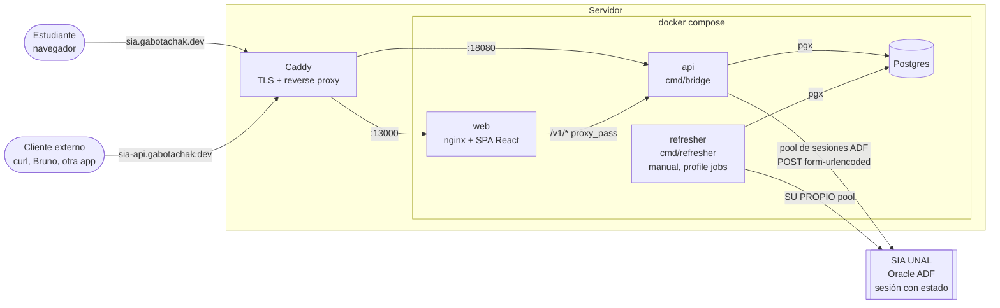

La regla que importa: `conexiones(api) + conexiones(refresher) ≤ 80` sesiones ADF
simultáneas. Es el techo medido del SIA ([OPEN-QUESTIONS.md](OPEN-QUESTIONS.md) §5).

---

## 2. Despliegue: contenedores y CI/CD

Un merge a `main` dispara `semantic-release`, que versiona según el mensaje del commit
([COMMIT-CONVENTION.md](COMMIT-CONVENTION.md)). Luego `paths-filter` decide qué hay que
redesplegar y solo eso se toca por SSH.

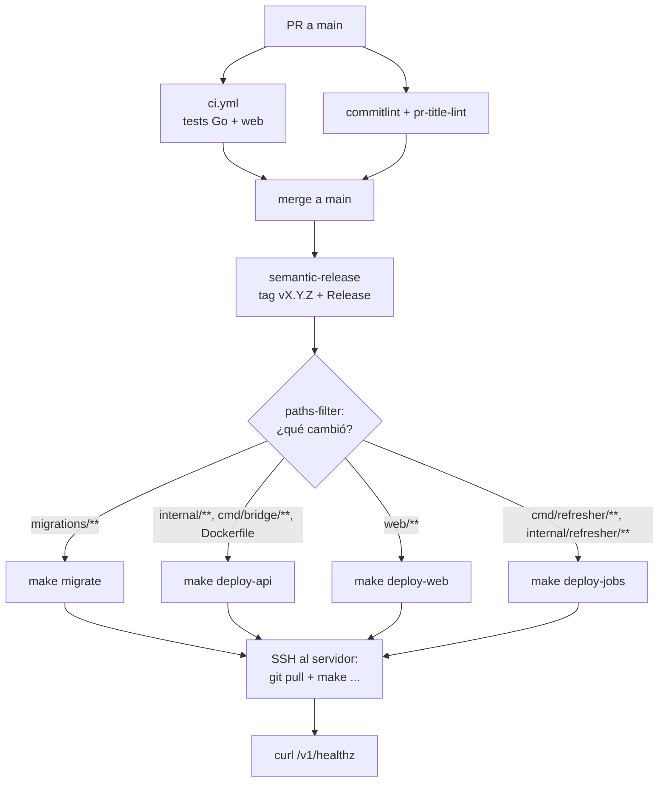

Los comandos concretos están en [COMMANDS.md](COMMANDS.md).

---

## 3. El hexágono

El dominio (`internal/catalog`) está en el centro y no sabe de HTTP, SQL ni ADF. Declara
dos **puertos driven** (`Store`, `SIASource`) como interfaces en `ports.go`. Los adaptadores
de afuera los implementan. Dos **adaptadores driving** (`httpapi` y `refresher`) entran por
el mismo `catalog.Service`.

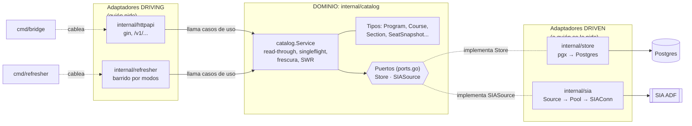

Por qué así:

- El `Refresher` **no escribe en la base por su cuenta**. Entra por `catalog.Service`,
  igual que un cliente HTTP. Hay un solo upsert de catálogo, no dos que se desincronicen.
- `gin.Context` nunca cruza al dominio: los handlers pasan `c.Request.Context()`.
- `cmd/*` son el único sitio con *wiring*. No tienen lógica.

---

## 4. Las dependencias entre paquetes

Todas las flechas apuntan hacia `catalog`. Ningún paquete de adentro importa uno de
afuera. `internal/catalog/hexagon_test.go` falla si eso se rompe.

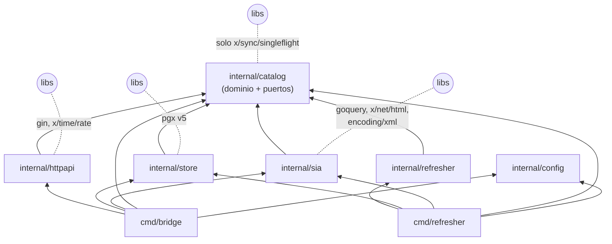

Prohibido, y verificado por test:

- `catalog` importando `gin`, `pgx`, `goquery` o `encoding/xml`.
- `catalog` o `refresher` importando `sia`, `store` o `httpapi`.

---

## 5. Arranque: `cmd/bridge`

`main.go` arma las piezas de adentro hacia afuera y arranca el servidor. El pool queda
**usable** con 4 conexiones y termina de llenarse en segundo plano.

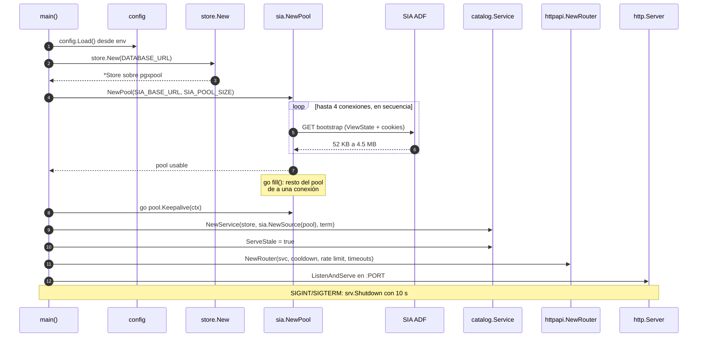

---

## 6. Una petición HTTP de punta a punta

El camino completo de `GET /v1/campuses/1101/programs/2A74/courses/2016696` cuando no
está en cache. Cada caja es un paquete distinto.

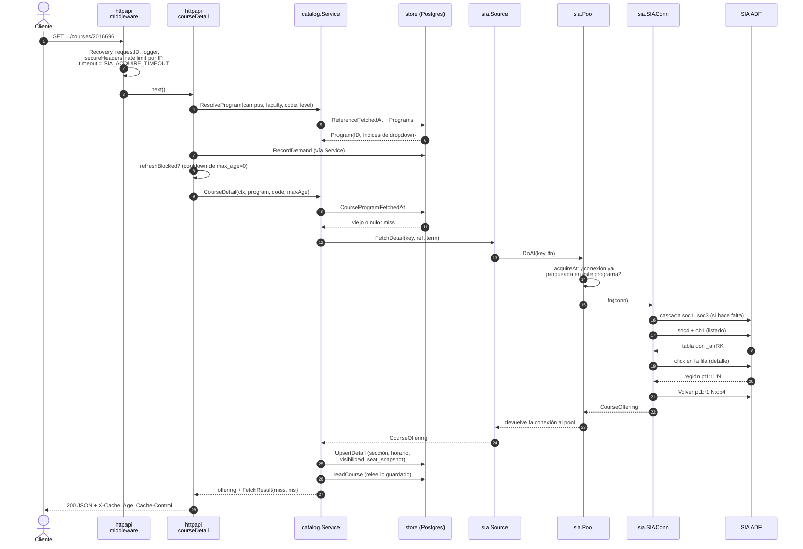

Con la conexión ya parqueada en el programa son 2 POSTs y ~1.3 s. En frío son
1 GET + 6 POSTs y ~10 s ([ARCH.md](ARCH.md), "Rutas mínimas medidas").

---

## 7. Rutas, handlers y casos de uso

Qué handler atiende cada ruta y en qué método de `catalog.Service` termina. Las rutas
grises nunca llaman al SIA: leen solo Postgres.

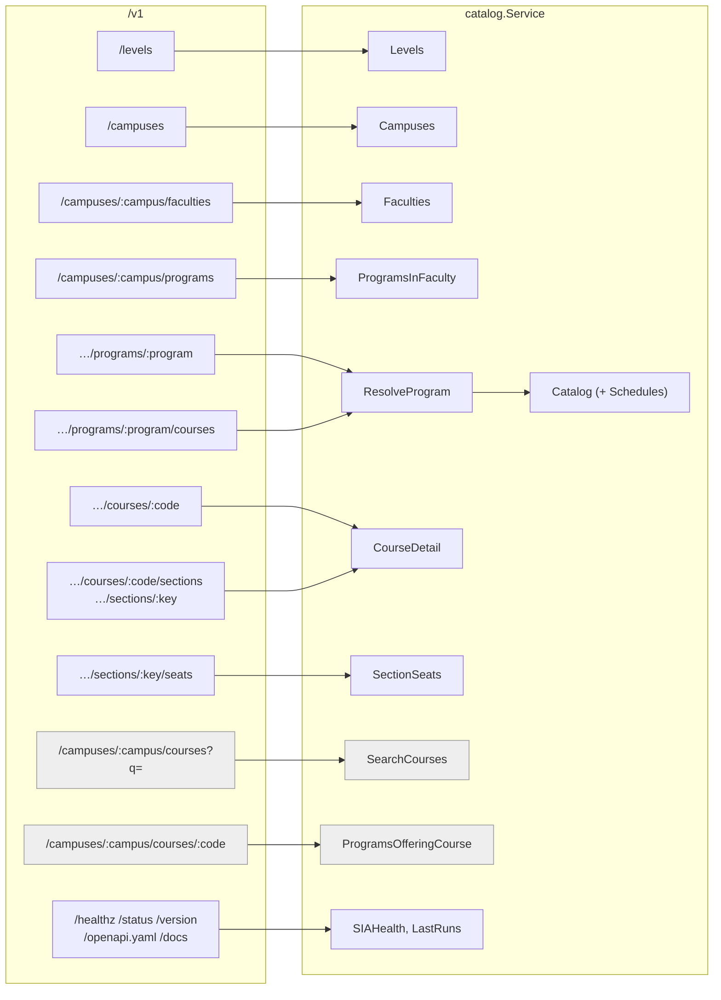

Todas las rutas bajo `…/programs/:program` resuelven el programa primero
(`resolveProgram` → `Service.ResolveProgram`). Detalle, secciones y cupos son **el mismo
POST** visto de cuatro formas, así que comparten fetch, cache y cooldown.

---

## 8. Flujo de referencia: de código público a índice de dropdown

El cliente habla en códigos (`1101`, `2A74`, `pregrado`). El SIA navega por **posiciones**
de dropdown, que son volátiles. `Service.coordinates` es el único sitio donde un código se
convierte en índice, y lo hace leyendo la cache de referencia (TTL 30 días).

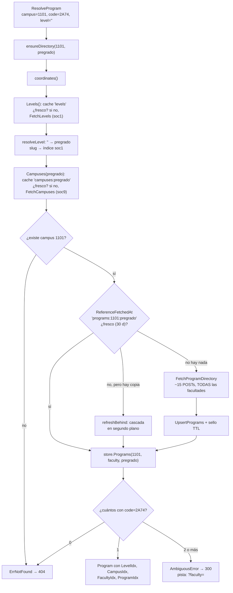

Un miss de directorio llena **todas** las facultades de la sede: la cascada ya pagó por
ellas.

---

## 9. Flujo de catálogo: stale-while-revalidate

El catálogo de un plan casi no cambia en el semestre. Con `ServeStale` (activo en
`cmd/bridge`), si hay **cualquier** copia guardada se responde ya y el SIA se consulta por
detrás. Solo espera quien nunca abrió ese programa, o quien fuerza `?max_age=0`.

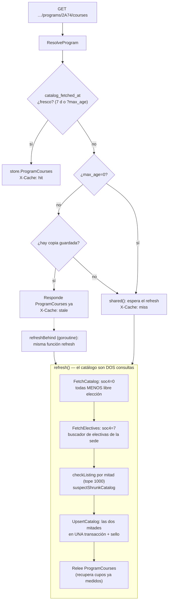

`?include=schedules` añade `Service.Schedules`, que lee solo Postgres: nunca dispara al
SIA.

---

## 10. Flujo de detalle: read-through con tres atajos

El detalle **no** es SWR: trae cupos, y unos cupos viejos servidos como frescos mentirían.
Pero hay tres salidas antes de gastar un POST, y una red de seguridad si el SIA falla.

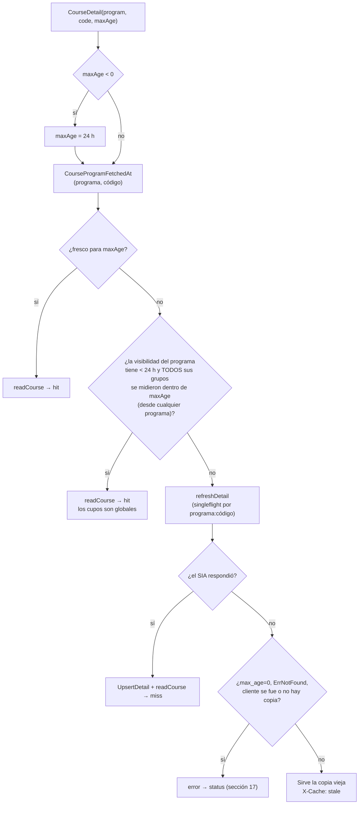

Dentro de `refreshDetail`, el nombre guardado filtra el listado por `it11` (de 241 KB
a 15–27 KB). Si la tipología es libre elección, se busca primero en electivas.

Antes de todo esto, el handler aplica el **cooldown**: un `max_age` menor que
`FETCH_COOLDOWN` sobre una asignatura recién traída responde `429 refresh_cooldown` con
`Retry-After`.

---

## 11. Flujo de cupos

Los cupos son el único dato volátil (TTL 5 min). Pero nunca llegan solos: traerlos cuesta
el detalle completo. Por eso un miss de cupos **guarda todo** y devuelve solo la sección
pedida.

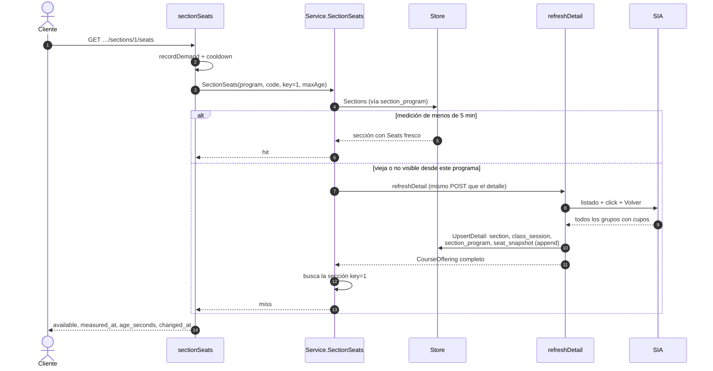

`seat_snapshot` es *append-only*: cada medición queda como historia.

---

## 12. Deduplicación: `shared` y `refreshBehind`

Dos piezas en `catalog/service.go` evitan pedir al SIA lo mismo dos veces.

- **`shared`**: un `singleflight` por clave (`catalog:<id>`, `<id>:<code>`, scope de
  referencia). Diez clientes que piden lo mismo en frío generan **un** fetch. Si el primer
  cliente cancela, el fetch sigue: corre con `context.WithoutCancel` y el *deadline*
  original.
- **`refreshBehind`**: la mitad *revalidate* del SWR. Como mucho un arranque por clave por
  minuto. Corre en el carril de fondo del pool (`WithBackground`) con su propio timeout de
  3 min.

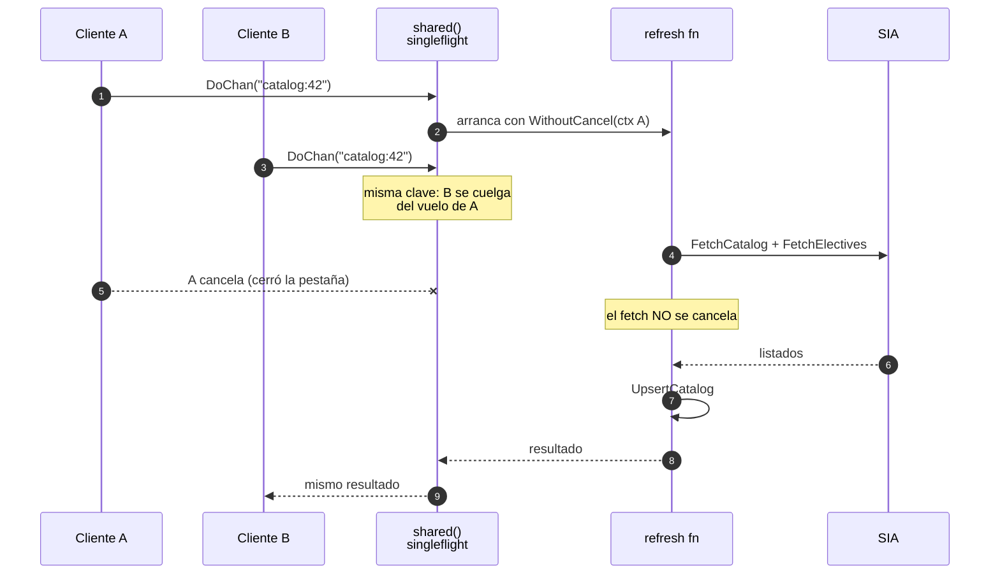

---

## 13. Dentro de `SIASource`: el pool

`sia.Source` implementa el puerto `SIASource`. Cada método termina en `DoAt`, que toma una
conexión del pool, ejecuta la **operación lógica entera** con ella y la devuelve
**utilizable**. El canal con buffer **es** el mutex: mientras una conexión está fuera del
canal, nadie más la toca.

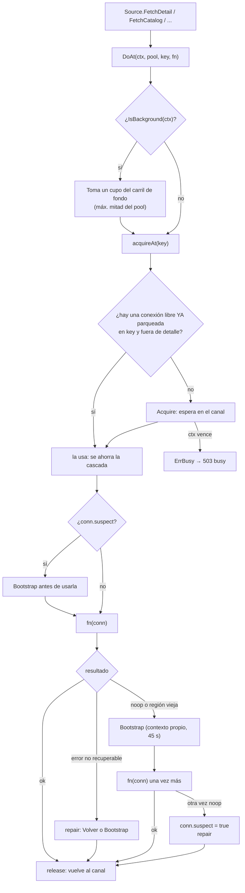

Reglas que el pool impone:

- **N peticiones concurrentes = N conexiones.** Nunca dos operaciones sobre una sesión: el
  SIA no lo rechaza, le da a un hilo la respuesta del otro (GOTCHAS §28).
- La reparación **nunca** usa el contexto del cliente: un cliente que cancela es justo el
  caso en que la conexión queda a mitad de operación.

---

## 14. La conexión ADF como máquina de estados

Una `SIAConn` es una sesión ADF viva. Lo que ahorra POSTs es **saber dónde está**:
`navLevel/navCampus/navFaculty`, `ParkedAt`, `navTipologia` y `DetailRegion`.

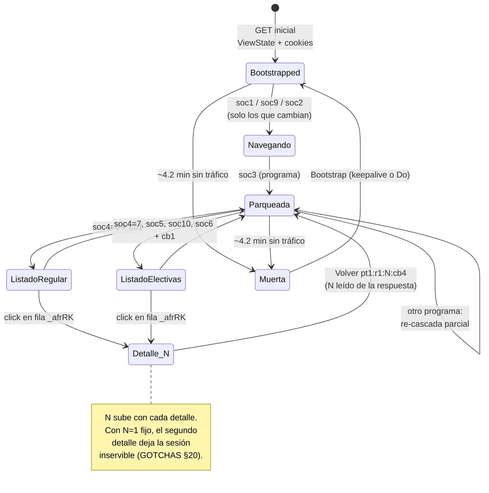

En la región de detalle, cualquier acción del buscador es un **no-op de ~900 B**.
`noop.go` lo convierte en `ErrSIANoop`. Nunca se trata como éxito.

---

## 15. Las dos cascadas, POST por POST

El catálogo de un plan son **dos** búsquedas: la regular (`soc4=0`, todo menos libre
elección) y la de electivas (`soc4=7`, por sede). Cada `valueChange` se salta si la
conexión ya tiene ese valor. Excepción: los que hay que forzar con un "rebote" para que
ADF re-renderice (GOTCHAS §30).

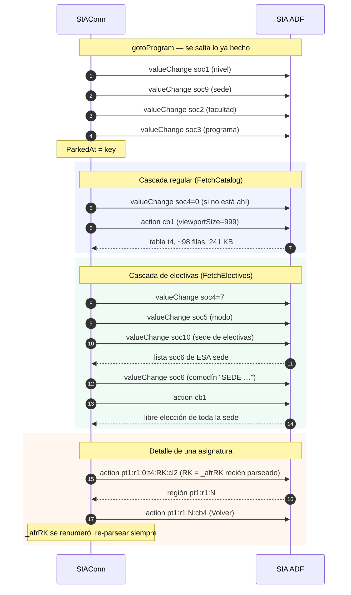

---

## 16. Keepalive

Una sesión muere a los ~4.2 min de silencio. Un ticker de 3 min no alcanza: una conexión
liberada justo después de un tick llega al siguiente con 2:59 y se salta. Por eso el
ticker corre cada **45 s** y hace ping a todo lo que lleve **≥ 2 min** quieto.

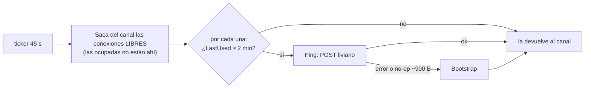

---

## 17. Errores de dominio a status HTTP

El dominio devuelve errores con nombre (`catalog/errors.go`). Solo `httpapi/errors.go` sabe
de status codes.

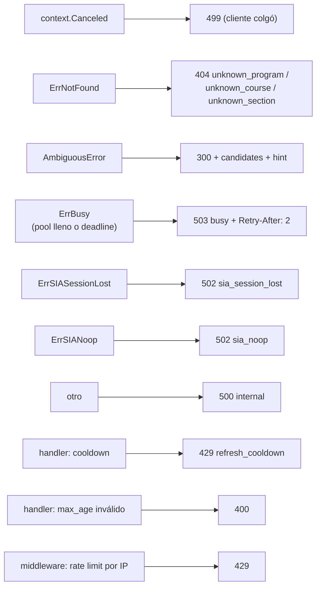

---

## 18. El `Refresher`

Hoy es una **herramienta manual**. Su cron se abandonó el 2026-09-21, porque el SWR de la
API cubre lo que el cron cubría. Levanta su **propio pool** y entra por el mismo
`catalog.Service` (con `ServeStale` apagado: él sí quiere esperar el fetch).

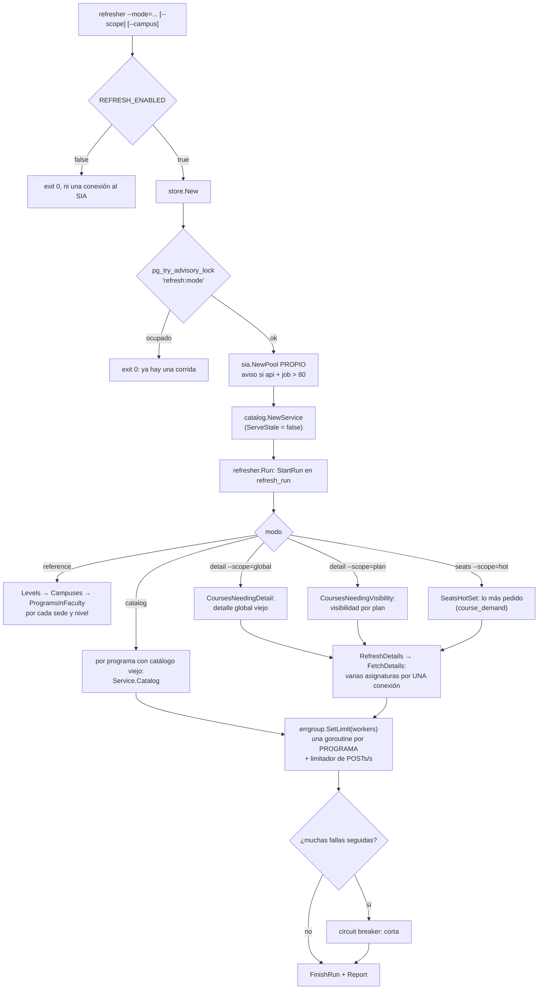

El checkpoint son los **marcadores de frescura**, no un cursor. Reanudar es volver a
correr. Dos corridas seguidas no hacen ni un POST.

---

## 19. Modelo de datos

Dos granularidades de cache: el catálogo es **por programa** (`course_program`) y el
detalle es **por asignatura** (`section`). Los grupos visibles dependen del programa
(`section_program`). Los cupos son globales (`seat_snapshot` cuelga de `section`).

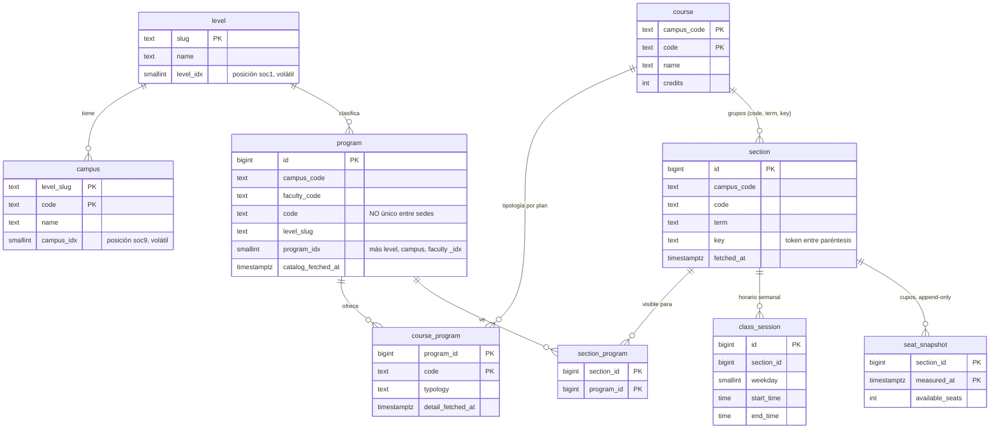

Tablas de apoyo, sin relaciones de dominio:

- `reference_fetch`: sello de TTL por lista (`levels`, `campuses:pregrado`,
  `programs:1101:pregrado`).
- `course_demand`: cuántas veces pidió un **cliente** cada asignatura. Alimenta
  `seats --scope=hot`.
- `refresh_run`: bitácora de corridas del `Refresher`. Es observabilidad, no checkpoint.

Esquema completo y sus decisiones en [DATA-MODEL.md](DATA-MODEL.md).

### Frescura por recurso

| Recurso | TTL por defecto | Marcador | Comportamiento al vencer |
|---|---|---|---|
| Referencia (niveles, sedes, programas) | 30 d | `reference_fetch.fetched_at` | SWR |
| Catálogo de un programa | 7 d | `program.catalog_fetched_at` | SWR |
| Detalle de una asignatura | 24 h | `course_program.detail_fetched_at` | espera; copia vieja si el SIA falla |
| Cupos | 5 min | `seat_snapshot.measured_at` | espera |

`?max_age=<segundos>` cambia el TTL de una petición. `?max_age=0` fuerza el SIA.

---

## 20. La interfaz web

React + TypeScript, servida por nginx. Es **un cliente más** de la API pública: nunca toca
Postgres ni importa nada de `internal/`. No hay router: la pantalla activa es estado
(`useNav().screen`). El plan elegido vive en el navegador.

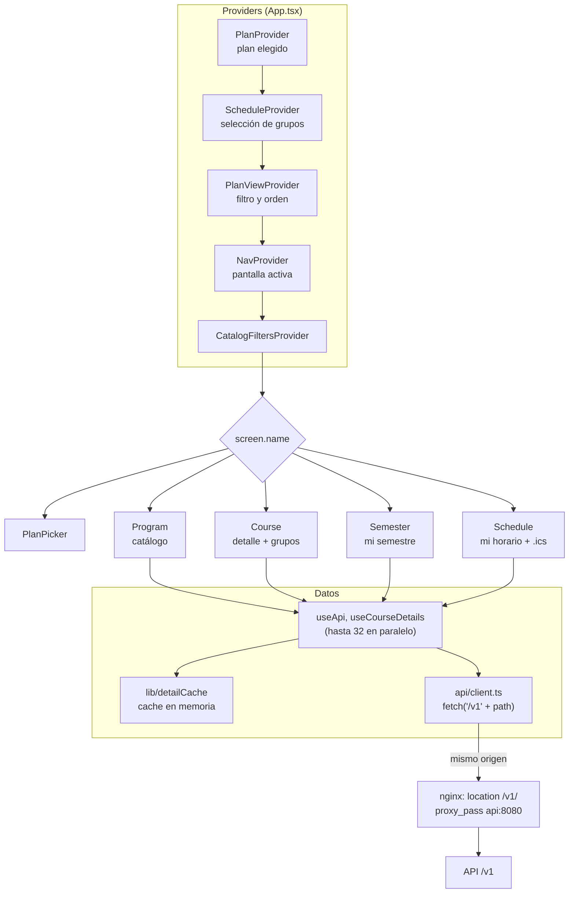

La medición automática de cupos de una tabla entera manda `?background=1`. Esas peticiones
van al carril de fondo del pool (sección 13), así que nunca ocupan todas las conexiones
mientras una persona espera la página que abrió. El botón "medir" manda `?max_age=0`,
sujeto al cooldown.
